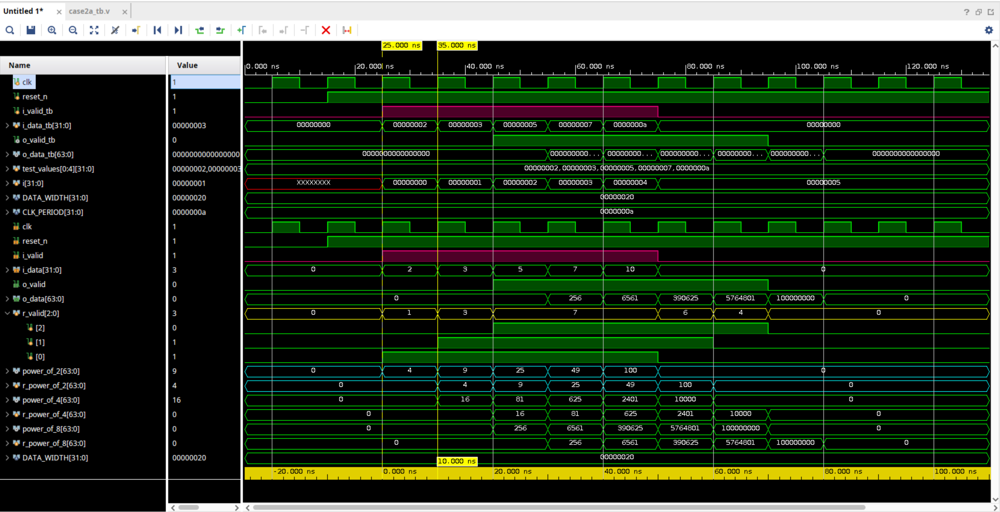
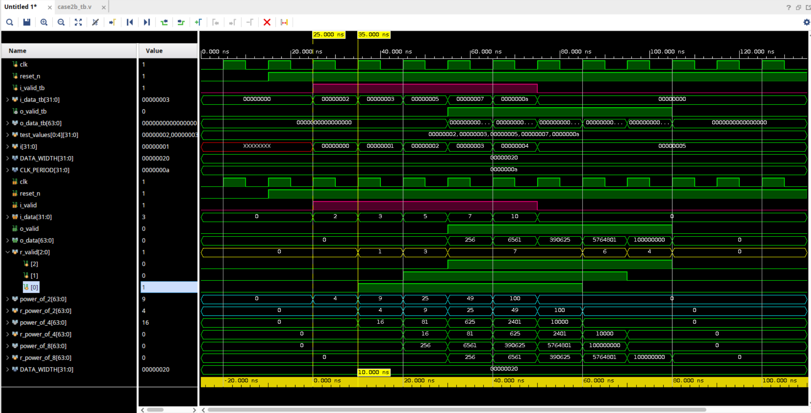

# Lab 3: Results and Observations

## Overview

This document provides detailed analysis and observations from the delta cycle case studies. Each case demonstrates the critical differences between blocking (`=`) and non-blocking (`<=`) assignments in Verilog testbenches, and their interaction with the DUT through delta cycles.

---

## Background Exercises: Understanding `@(posedge clk)` Placement

### Overview

Before diving into delta cycle race condition analysis, we first explore how `@(posedge clk)` placement affects stimulus timing. Both examples use **non-blocking assignments (`<=`)** to drive DUT inputs (race-free), so the focus is purely on **timing behavior**.

### Background Example 1 (basic1): `@(posedge clk)` INSIDE for-loop

**Testbench Pattern:**
```verilog
for (i = 0; i < 5; i = i + 1) begin
    @(posedge clk);          // Wait for clock edge INSIDE loop
    i_valid_tb <= 1'b1;      // Non-blocking assignment
    i_data_tb <= test_values[i];
end
```

**Expected Behavior:**
- Each iteration waits for a clock edge, then schedules signal updates
- Total time: **5 clock cycles** (one per iteration)
- Each test value is applied on a separate clock edge

**Timing Diagram:**
```
clk:      _/‾\_/‾\_/‾\_/‾\_/‾\_/‾\_
          T0  T1  T2  T3  T4  T5
               ↓   ↓   ↓   ↓   ↓
i_data:   X   D0  D1  D2  D3  D4   (updates at each posedge)
i_valid:  0    1   1   1   1   1
```

**Observations:**
- [ ] Waveform screenshot: `images/basic1.png`
- [ ] Confirm 5 separate clock cycles for 5 values
- [ ] Each `test_values[i]` appears on different clock edge
- [ ] This is the **CORRECT** pattern for sequential stimulus


---

### Background Example 2 (basic2): `@(posedge clk)` OUTSIDE for-loop

**Testbench Pattern:**
```verilog
for (i = 0; i < 5; i = i + 1) begin
    i_valid_tb <= 1'b1;      // Non-blocking assignment
    i_data_tb <= test_values[i];  // Loop runs in ZERO time!
end
@(posedge clk);              // Wait for clock edge OUTSIDE (after loop)
```

**Expected Behavior:**
- Loop completes **instantly** (same simulation time) - all 5 iterations at T0
- Each `<=` schedules an update, but later schedules overwrite earlier ones
- Only the **LAST value** (`test_values[4]`) is captured!
- Total time: **1 clock cycle**

**Timing Diagram:**
```
clk:      _/‾\_/‾\_
          T0  T1
               ↓
i_data:   X   D4   (only LAST value visible!)
i_valid:  0    1

At T0: Loop schedules D0, D1, D2, D3, D4 (all at same time)
       But each <= to same signal overwrites previous schedule
       Only D4 remains when NBA region executes
```

**Observations:**
- [ ] Waveform screenshot: `images/basic2.png`
- [ ] Confirm only 1 clock cycle used despite 5 iterations
- [ ] Confirm only `test_values[4]` (0x0000000A) appears in waveform
- [ ] This is a **COMMON BUG** - loop appears to work but loses data!


---

### Comparison: basic1 vs basic2

| Aspect | basic1 (inside loop) | basic2 (outside loop) |
|--------|---------------------|----------------------|
| **`@(posedge clk)` location** | Inside for-loop | Outside for-loop |
| **Clock cycles used** | 5 cycles | 1 cycle |
| **Data captured by DUT** | All 5 values | Only last value (D4) |
| **Loop execution time** | 5 clock periods | 0 time (instant) |
| **Common use case** | Sequential stimulus | ⚠️ Usually a BUG! |

### Key Learning

This background exercise demonstrates that **`@(posedge clk)` placement fundamentally changes timing behavior**, even when using non-blocking assignments correctly:

1. **basic1 (inside loop)**: Proper sequential stimulus generation
   - Each value gets its own clock cycle
   - DUT can process each value separately

2. **basic2 (outside loop)**: Common mistake leading to data loss
   - Loop runs instantly, scheduling multiple updates to same signal
   - Only the last scheduled value survives to NBA region
   - **4 out of 5 values are LOST!**

**Important**: This is NOT a race condition issue (both use non-blocking assignments). This is a **timing/scheduling** issue caused by misunderstanding when `@(posedge clk)` executes relative to the loop.

---

## Case 1: Assignment After @(posedge clk)

### Test Description

Both Case 1A and Case 1B drive input signals **after** waiting for the clock edge using a for loop in an initial block:

```verilog
for (i = 0; i < 5; i = i + 1) begin
    @(posedge clk);
    // Assignment happens HERE (after clock edge)
    i_valid_tb = 1'b1;   // Case 1A: Blocking
    // OR
    i_valid_tb <= 1'b1;  // Case 1B: Non-blocking
end
```

### Case 1A: Blocking Assignment (Race Condition)


#### Key Observations:

1. **Race Condition Present**: The testbench uses blocking assignment (`=`) which executes immediately in the Active Region, creating a race condition with the DUT.

2. **Unpredictable Behavior**: Since both the TB and DUT execute in the Active Region at the same clock edge, the execution order is **undefined by IEEE 1364 standard**.

3. **Simulator Dependency**: The actual behavior depends on which scenario the simulator chooses. Different simulators (Vivado, ModelSim, Icarus) or different versions may produce different results.

#### Delta Cycle Analysis (T=30ns, first data after reset):

```
═══════════════════════════════════════════════════════════════════════════════
                         TIME T=30ns: posedge clk occurs
═══════════════════════════════════════════════════════════════════════════════

┌─────────────────────────────────────────────────────────────────────────────┐
│ ACTIVE REGION                                                               │
├─────────────────────────────────────────────────────────────────────────────┤
│                                                                             │
│ Both blocks are triggered and ready to execute:                             │
│                                                                             │
│   TB initial block              DUT always block                            │
│   ──────────────────            ─────────────────                           │
│   @(posedge clk);               always @(posedge clk)                       │
│   i_valid_tb = 1'b1;  ←─?─→     r_valid[0] <= i_valid;                      │
│   i_data_tb = 0x02;             r_power_of_2 <= i_data * i_data;            │
│                                                                             │
│ ⚠️  Which block executes first? → UNDEFINED by IEEE standard!               │
│                                                                             │
├─────────────────────────────────────────────────────────────────────────────┤
│ SCENARIO A: TB executes first                                               │
├─────────────────────────────────────────────────────────────────────────────┤
│                                                                             │
│   Step 1: TB runs                                                           │
│   ┌──────────────────────────────────────────────────────────────┐          │
│   │ i_valid_tb = 1'b1;  → i_valid changes 0→1 IMMEDIATELY        │          │
│   │ i_data_tb = 0x02;   → i_data changes 0→2 IMMEDIATELY         │          │
│   └──────────────────────────────────────────────────────────────┘          │
│                                                                             │
│   Step 2: DUT runs (after TB finished)                                      │
│   ┌──────────────────────────────────────────────────────────────┐          │
│   │ r_valid[0] <= i_valid;  → read i_valid (sees 1'b1 - NEW!)    │          │
│   │                         → [SCHEDULE TO NBA]: r_valid[0] = 1  │          │
│   │ r_power_of_2 <= 2*2;    → read i_data (sees 0x02 - NEW!)     │          │
│   │                         → [SCHEDULE TO NBA]: r_power_of_2 = 4│          │
│   └──────────────────────────────────────────────────────────────┘          │
│                                                                             │
│   Result: DUT captures NEW values at SAME clock edge (no delay!)            │
│                                                                             │
├─────────────────────────────────────────────────────────────────────────────┤
│ SCENARIO B: DUT executes first                                              │
├─────────────────────────────────────────────────────────────────────────────┤
│                                                                             │
│   Step 1: DUT runs                                                          │
│   ┌──────────────────────────────────────────────────────────────┐          │
│   │ r_valid[0] <= i_valid;  → read i_valid (sees 1'b0 - OLD!)    │          │
│   │                         → [SCHEDULE TO NBA]: r_valid[0] = 0  │          │
│   │ r_power_of_2 <= 0*0;    → read i_data (sees 0x00 - OLD!)     │          │
│   │                         → [SCHEDULE TO NBA]: r_power_of_2 = 0│          │
│   └──────────────────────────────────────────────────────────────┘          │
│                                                                             │
│   Step 2: TB runs (after DUT finished)                                      │
│   ┌──────────────────────────────────────────────────────────────┐          │
│   │ i_valid_tb = 1'b1;  → i_valid changes 0→1                    │
│   │ i_data_tb = 0x02;   → i_data changes 0→2                     │
│   └──────────────────────────────────────────────────────────────┘          │
│                                                                             │
│   Result: DUT captures OLD values, sees NEW at NEXT clock edge              │
│                                                                             │
├─────────────────────────────────────────────────────────────────────────────┤
│ 🚨 THIS IS THE RACE CONDITION!                                              │
│    Same code, same time T=30ns, but different results depending on          │
│    which block the simulator chooses to run first!                          │
└─────────────────────────────────────────────────────────────────────────────┘

┌─────────────────────────────────────────────────────────────────────────────┐
│ NBA REGION (after Active region completes)                                  │
├─────────────────────────────────────────────────────────────────────────────┤
│                                                                             │
│   All scheduled non-blocking updates execute now:                           │
│   ┌──────────────────────────────────────────────────────────────┐          │
│   │ r_valid[0] ← ???    (1 if Scenario A, 0 if Scenario B)       │          │
│   │ r_power_of_2 ← ???  (4 if Scenario A, 0 if Scenario B)       │          │
│   └──────────────────────────────────────────────────────────────┘          │
│                                                                             │
└─────────────────────────────────────────────────────────────────────────────┘
```

#### Comparison of Scenarios:

| Aspect | Scenario A (TB first) | Scenario B (DUT first) |
|--------|----------------------|------------------------|
| **i_valid when DUT reads** | 1 (NEW) | 0 (OLD) |
| **i_data when DUT reads** | 0x02 (NEW) | 0x00 (OLD) |
| **r_valid[0] after NBA** | 1 | 0 |
| **r_power_of_2 after NBA** | 4 | 0 |
| **First valid output** | T=30ns | T=40ns |

### Case 1B: Non-blocking Assignment (Race-Free)


#### Key Observations:

1. **No Race Condition**: The testbench uses non-blocking assignment (`<=`) which schedules updates to the NBA Region, avoiding race conditions.

2. **Predictable Behavior**: The execution order is **well-defined** because reads and writes happen in different regions.

3. **One Clock Cycle Delay**: Input changes are visible to the DUT at the **next clock edge**, providing setup time for proper operation.

#### Delta Cycle Analysis (T=30ns, first data after reset):

```
═══════════════════════════════════════════════════════════════════════════════
                         TIME T=30ns: posedge clk occurs
═══════════════════════════════════════════════════════════════════════════════

┌─────────────────────────────────────────────────────────────────────────────┐
│ ACTIVE REGION                                                               │
├─────────────────────────────────────────────────────────────────────────────┤
│                                                                             │
│ Both blocks are triggered and ready to execute:                             │
│                                                                             │
│   TB initial block              DUT always block                            │
│   ──────────────────            ─────────────────                           │
│   @(posedge clk);               always @(posedge clk)                       │
│   i_valid_tb <= 1'b1; ←─?─→     r_valid[0] <= i_valid;                      │
│   i_data_tb <= 0x02;            r_power_of_2 <= i_data * i_data;            │
│                                                                             │
│ Order still UNDEFINED, but it DOESN'T MATTER with non-blocking!             │
│                                                                             │
├─────────────────────────────────────────────────────────────────────────────┤
│ SCENARIO A: TB executes first (same result as B!)                           │
├─────────────────────────────────────────────────────────────────────────────┤
│                                                                             │
│   Step 1: TB runs                                                           │
│   ┌──────────────────────────────────────────────────────────────┐          │
│   │ i_valid_tb <= 1'b1; → [SCHEDULE TO NBA]: i_valid = 1         │          │
│   │                       (i_valid is STILL 0 now!)              │          │
│   │ i_data_tb <= 0x02;  → [SCHEDULE TO NBA]: i_data = 0x02       │          │
│   │                       (i_data is STILL 0 now!)               │          │
│   └──────────────────────────────────────────────────────────────┘          │
│                                                                             │
│   Step 2: DUT runs (after TB finished)                                      │
│   ┌──────────────────────────────────────────────────────────────┐          │
│   │ r_valid[0] <= i_valid;  → read i_valid (sees 1'b0 - OLD)     │          │
│   │                         → [SCHEDULE TO NBA]: r_valid[0] = 0  │          │
│   │ r_power_of_2 <= 0*0;    → read i_data (sees 0x00 - OLD)      │          │
│   │                         → [SCHEDULE TO NBA]: r_power_of_2 = 0│          │
│   └──────────────────────────────────────────────────────────────┘          │
│                                                                             │
├─────────────────────────────────────────────────────────────────────────────┤
│ SCENARIO B: DUT executes first (same result as A!)                          │
├─────────────────────────────────────────────────────────────────────────────┤
│                                                                             │
│   Step 1: DUT runs                                                          │
│   ┌──────────────────────────────────────────────────────────────┐          │
│   │ r_valid[0] <= i_valid;  → read i_valid (sees 1'b0 - OLD)     │          │
│   │                         → [SCHEDULE TO NBA]: r_valid[0] = 0  │          │
│   │ r_power_of_2 <= 0*0;    → read i_data (sees 0x00 - OLD)      │          │
│   │                         → [SCHEDULE TO NBA]: r_power_of_2 = 0│          │
│   └──────────────────────────────────────────────────────────────┘          │
│                                                                             │
│   Step 2: TB runs (after DUT finished)                                      │
│   ┌──────────────────────────────────────────────────────────────┐          │
│   │ i_valid_tb <= 1'b1; → [SCHEDULE TO NBA]: i_valid = 1         │          │
│   │ i_data_tb <= 0x02;  → [SCHEDULE TO NBA]: i_data = 0x02       │          │
│   └──────────────────────────────────────────────────────────────┘          │
│                                                                             │
├─────────────────────────────────────────────────────────────────────────────┤
│ ✅ NO RACE CONDITION!                                                       │
│    Both scenarios produce IDENTICAL results because:                        │
│    - TB only SCHEDULES updates (doesn't change values immediately)          │
│    - DUT always reads OLD values in Active Region                           │
│    - Updates happen together in NBA Region (after all reads)                │
└─────────────────────────────────────────────────────────────────────────────┘

┌─────────────────────────────────────────────────────────────────────────────┐
│ NBA REGION (after Active region completes)                                  │
├─────────────────────────────────────────────────────────────────────────────┤
│                                                                             │
│   All scheduled non-blocking updates execute now:                           │
│   ┌──────────────────────────────────────────────────────────────┐          │
│   │ i_valid_tb ← 1      (TB's scheduled update)                  │          │
│   │ i_data_tb ← 0x02    (TB's scheduled update)                  │          │
│   │ r_valid[0] ← 0      (DUT's scheduled update - read OLD)      │          │
│   │ r_power_of_2 ← 0    (DUT's scheduled update - read OLD)      │          │
│   └──────────────────────────────────────────────────────────────┘          │
│                                                                             │
│   Result: i_valid=1, i_data=0x02, but DUT captured OLD values (0, 0)        │
│                                                                             │
└─────────────────────────────────────────────────────────────────────────────┘

═══════════════════════════════════════════════════════════════════════════════
                         TIME T=40ns: next posedge clk
═══════════════════════════════════════════════════════════════════════════════

┌─────────────────────────────────────────────────────────────────────────────┐
│ ACTIVE REGION                                                               │
├─────────────────────────────────────────────────────────────────────────────┤
│                                                                             │
│   DUT runs:                                                                 │
│   ┌──────────────────────────────────────────────────────────────┐          │
│   │ r_valid[0] <= i_valid;  → read i_valid (sees 1'b1 - NEW!)    │          │
│   │                         → [SCHEDULE TO NBA]: r_valid[0] = 1  │          │
│   │ r_power_of_2 <= 2*2;    → read i_data (sees 0x02 - NEW!)     │          │
│   │                         → [SCHEDULE TO NBA]: r_power_of_2 = 4│          │
│   └──────────────────────────────────────────────────────────────┘          │
│                                                                             │
└─────────────────────────────────────────────────────────────────────────────┘

┌─────────────────────────────────────────────────────────────────────────────┐
│ NBA REGION                                                                  │
├─────────────────────────────────────────────────────────────────────────────┤
│                                                                             │
│   ┌──────────────────────────────────────────────────────────────┐          │
│   │ r_valid[0] ← 1      (DUT finally captures valid!)            │          │
│   │ r_power_of_2 ← 4    (DUT finally captures data!)             │          │
│   └──────────────────────────────────────────────────────────────┘          │
│                                                                             │
│   Result: Consistent one-cycle delay, predictable across all simulators     │
│                                                                             │
└─────────────────────────────────────────────────────────────────────────────┘
```

#### Why Non-blocking Avoids Race Conditions:

| Aspect | Scenario A (TB first) | Scenario B (DUT first) |
|--------|----------------------|------------------------|
| **i_valid when DUT reads** | 0 (OLD) | 0 (OLD) |
| **i_data when DUT reads** | 0x00 (OLD) | 0x00 (OLD) |
| **r_valid[0] after NBA** | 0 | 0 |
| **r_power_of_2 after NBA** | 0 | 0 |
| **First valid output** | T=40ns | T=40ns |

**Key Insight**: Both scenarios produce **identical results** because non-blocking assignments separate READ (Active Region) from WRITE (NBA Region)!

### Comparison: Case 1A vs Case 1B

| Aspect | Case 1A (Blocking) | Case 1B (Non-blocking) |
|--------|-------------------|----------------------|
| **Assignment Type** | `i_valid_tb = 1'b1` | `i_valid_tb <= 1'b1` |
| **Execution Region** | Active (immediate) | Active (RHS eval) + NBA (update) |
| **Race Condition** | YES | NO |
| **Behavior** | Simulator-dependent | Well-defined |
| **First Valid Capture** | T=10ns or T=20ns (unpredictable) | T=20ns (predictable) |
| **Portability** | Poor (different simulators may differ) | Excellent (consistent across simulators) |
| **Setup Time** | May violate (same-cycle update possible) | Guaranteed (one-cycle delay) |

### Signal Path Analysis

Both `i_valid` and `i_data` paths are affected by the race condition in Case 1A:

#### i_valid Path (Direct):
```verilog
// DUT
always @(posedge clk) begin
    r_valid[0] <= i_valid;  // Direct register path
end
```
- **Case 1A**: Race condition clearly visible in waveform (timing varies)
- **Case 1B**: Consistent one-cycle delay

#### i_data Path (Through Combinational Logic):
```verilog
// DUT
assign power_of_2 = i_data * i_data;  // Combinational

always @(posedge clk) begin
    r_power_of_2 <= power_of_2;  // Register combinational result
end
```
- **Case 1A**: Race condition exists but may be less visible in waveform
  - Combinational logic (`power_of_2`) evaluates in Active Region
  - Same race condition as i_valid, but manifestation may differ
  - Simulator-dependent behavior
- **Case 1B**: Consistent behavior
  - Combinational logic evaluates with old `i_data` value
  - Updates propagate to register at next clock edge

**Important Note**: The presence of combinational logic does **not** eliminate the race condition with blocking assignments. Both direct and combinational paths suffer from the same Active Region execution order uncertainty. The race affects **which value** gets processed, not the timing of register updates.

### Recommendations

1. **Always use non-blocking assignments (`<=`) in testbenches** when driving clocked DUT inputs from clocked always blocks or after `@(posedge clk)`.

2. **Blocking assignments (`=`) are only safe** in initial blocks for initialization or when there's guaranteed separation from DUT clock edges.

3. **Test across multiple simulators** if blocking assignments are used, as behavior may vary.

4. **Understand delta cycle regions**:
   - Active Region: Blocking assignments execute, non-blocking RHS evaluated
   - NBA Region: Non-blocking assignments update
   - Proper separation prevents race conditions

---

## Case 2: Assignment Before @(posedge clk)

### Test Description

Case 2 explores a different scenario: **assigning values at a time that is NOT on a posedge clk**, then waiting for the next posedge. This is fundamentally different from Case 1 because the assignment happens when the DUT is not active.

Both Case 2A and Case 2B drive input signals **after negedge clk** (middle of clock period), then wait for posedge clk:

```verilog
   //case2a
    for (i = 0; i < 5; i = i + 1) begin
        @(negedge clk);
        i_valid_tb = 1'b1;
        i_data_tb = test_values[i];
        @(posedge clk);
    end
```

```verilog
   //case2b
    for (i = 0; i < 5; i = i + 1) begin
        @(negedge clk);
        i_valid_tb <= 1'b1;
        i_data_tb <= test_values[i];
        @(posedge clk);
    end
```

**Why This Matters**: If assignments happen exactly at posedge clk (like Case 1), there's potential for race conditions with blocking assignments. But what happens when we assign **between** clock edges, where the DUT is not triggered?

### Case 2A: Blocking Assignment Between Edges (Race-Free!)



#### Key Observations:

1. **No Race Condition**: Unlike Case 1A, there is NO race condition here! The blocking assignment executes at negedge time when the DUT's `always @(posedge clk)` block is not active.

2. **Time Separation**: At negedge (e.g., T=35ns), only the TB is active. The DUT won't trigger until the next posedge (T=40ns).

3. **Stable Inputs**: By the time posedge arrives, the input values are already stable (good setup time).

#### Delta Cycle Analysis (T=40ns, posedge clk):

```
═══════════════════════════════════════════════════════════════════════════════
           TIME T=35ns: negedge clk occurs (BEFORE posedge)
═══════════════════════════════════════════════════════════════════════════════

┌─────────────────────────────────────────────────────────────────────────────┐
│ ACTIVE REGION                                                               │
├─────────────────────────────────────────────────────────────────────────────┤
│                                                                             │
│   Only TB is active (DUT triggers on posedge, not negedge):                 │
│                                                                             │
│   TB initial block              DUT always block                            │
│   ──────────────────            ─────────────────                           │
│   @(negedge clk);               always @(posedge clk)  ← NOT triggered!     │
│   i_valid_tb = 1'b1;            (sleeping, waiting for posedge)             │
│   i_data_tb = 0x03;                                                         │
│                                                                             │
│   ✅ NO RACE! DUT is not executing at negedge time!                         │
│                                                                             │
├─────────────────────────────────────────────────────────────────────────────┤
│ TB executes alone:                                                          │
├─────────────────────────────────────────────────────────────────────────────┤
│                                                                             │
│   ┌──────────────────────────────────────────────────────────────┐          │
│   │ i_valid_tb = 1'b1;  → i_valid changes to 1 IMMEDIATELY       │          │
│   │ i_data_tb = 0x03;   → i_data changes to 3 IMMEDIATELY        │          │
│   │ @(posedge clk);     → TB now waits for next rising edge      │          │
│   └──────────────────────────────────────────────────────────────┘          │
│                                                                             │
│   Result: Inputs are now stable, waiting for posedge                        │
│                                                                             │
└─────────────────────────────────────────────────────────────────────────────┘

═══════════════════════════════════════════════════════════════════════════════
           TIME T=40ns: posedge clk occurs (DUT triggers)
═══════════════════════════════════════════════════════════════════════════════

┌─────────────────────────────────────────────────────────────────────────────┐
│ ACTIVE REGION                                                               │
├─────────────────────────────────────────────────────────────────────────────┤
│                                                                             │
│   DUT triggers, TB is waiting on @(posedge clk):                            │
│                                                                             │
│   TB initial block              DUT always block                            │
│   ──────────────────            ─────────────────                           │
│   (waiting on @posedge)         always @(posedge clk)  ← TRIGGERED!         │
│                                 r_valid[0] <= i_valid;                      │
│                                 r_power_of_2 <= i_data * i_data;            │
│                                                                             │
├─────────────────────────────────────────────────────────────────────────────┤
│ DUT executes:                                                               │
├─────────────────────────────────────────────────────────────────────────────┤
│                                                                             │
│   ┌──────────────────────────────────────────────────────────────┐          │
│   │ r_valid[0] <= i_valid;  → read i_valid (sees 1'b1 - stable!) │          │
│   │                         → [SCHEDULE TO NBA]: r_valid[0] = 1  │          │
│   │ r_power_of_2 <= 3*3;    → read i_data (sees 0x03 - stable!)  │          │
│   │                         → [SCHEDULE TO NBA]: r_power_of_2 = 9│          │
│   └──────────────────────────────────────────────────────────────┘          │
│                                                                             │
│   TB @(posedge clk) also completes, loop continues                          │
│                                                                             │
└─────────────────────────────────────────────────────────────────────────────┘

┌─────────────────────────────────────────────────────────────────────────────┐
│ NBA REGION                                                                  │
├─────────────────────────────────────────────────────────────────────────────┤
│                                                                             │
│   ┌──────────────────────────────────────────────────────────────┐          │
│   │ r_valid[0] ← 1      (DUT captured stable i_valid)            │          │
│   │ r_power_of_2 ← 9    (DUT captured stable i_data = 3)         │          │
│   └──────────────────────────────────────────────────────────────┘          │
│                                                                             │
│   Result: DUT captures CURRENT iteration's data (deterministic!)            │
│                                                                             │
└─────────────────────────────────────────────────────────────────────────────┘
```

#### Key Insight - Why No Race:

| Aspect | Case 2A (Between Edges) |
|--------|-------------------------|
| **When TB assigns** | T=35ns (negedge) |
| **When DUT reads** | T=40ns (posedge) |
| **Overlap?** | NO - different simulation times! |
| **Race Condition?** | NO |
| **i_data when DUT reads** | 0x03 (current, stable) |
| **r_power_of_2 after NBA** | 9 (3²) |

---

### Case 2B: Non-blocking Assignment Between Edges (Also Race-Free!)



#### Key Observations:

1. **Also No Race Condition**: Like Case 2A, there is no race because the assignment happens at negedge time.

2. **Same Functional Result**: Because the assignment happens between clock edges (not at posedge), the NBA updates complete before simulation time advances to posedge.

3. **Identical to Case 2A**: In this scenario, blocking and non-blocking produce the **same result**!

#### Delta Cycle Analysis (T=40ns, posedge clk):

```
═══════════════════════════════════════════════════════════════════════════════
           TIME T=35ns: negedge clk occurs (BEFORE posedge)
═══════════════════════════════════════════════════════════════════════════════

┌─────────────────────────────────────────────────────────────────────────────┐
│ ACTIVE REGION                                                               │
├─────────────────────────────────────────────────────────────────────────────┤
│                                                                             │
│   Only TB is active:                                                        │
│                                                                             │
│   ┌──────────────────────────────────────────────────────────────┐          │
│   │ i_valid_tb <= 1'b1; → [SCHEDULE TO NBA]: i_valid = 1         │          │
│   │ i_data_tb <= 0x03;  → [SCHEDULE TO NBA]: i_data = 0x03       │          │
│   │ @(posedge clk);     → TB now waits for next rising edge      │          │
│   └──────────────────────────────────────────────────────────────┘          │
│                                                                             │
│   DUT is NOT active (only triggers on posedge clk)                          │
│                                                                             │
└─────────────────────────────────────────────────────────────────────────────┘

┌─────────────────────────────────────────────────────────────────────────────┐
│ NBA REGION (at T=35ns, before simulation time advances)                     │
├─────────────────────────────────────────────────────────────────────────────┤
│                                                                             │
│   ┌──────────────────────────────────────────────────────────────┐          │
│   │ i_valid_tb ← 1      (update happens NOW, at negedge time)    │          │
│   │ i_data_tb ← 0x03    (update happens NOW, at negedge time)    │          │
│   └──────────────────────────────────────────────────────────────┘          │
│                                                                             │
│   ✅ NBA completes BEFORE simulation advances to posedge!                   │
│   Inputs are now stable, same as Case 2A.                                   │
│                                                                             │
└─────────────────────────────────────────────────────────────────────────────┘

═══════════════════════════════════════════════════════════════════════════════
           TIME T=40ns: posedge clk occurs (DUT triggers)
═══════════════════════════════════════════════════════════════════════════════

┌─────────────────────────────────────────────────────────────────────────────┐
│ ACTIVE REGION                                                               │
├─────────────────────────────────────────────────────────────────────────────┤
│                                                                             │
│   DUT executes:                                                             │
│   ┌──────────────────────────────────────────────────────────────┐          │
│   │ r_valid[0] <= i_valid;  → read i_valid (sees 1'b1 - stable!) │          │
│   │                         → [SCHEDULE TO NBA]: r_valid[0] = 1  │          │
│   │ r_power_of_2 <= 3*3;    → read i_data (sees 0x03 - stable!)  │          │
│   │                         → [SCHEDULE TO NBA]: r_power_of_2 = 9│          │
│   └──────────────────────────────────────────────────────────────┘          │
│                                                                             │
└─────────────────────────────────────────────────────────────────────────────┘

┌─────────────────────────────────────────────────────────────────────────────┐
│ NBA REGION                                                                  │
├─────────────────────────────────────────────────────────────────────────────┤
│                                                                             │
│   ┌──────────────────────────────────────────────────────────────┐          │
│   │ r_valid[0] ← 1      (DUT captured stable i_valid)            │          │
│   │ r_power_of_2 ← 9    (DUT captured stable i_data = 3)         │          │
│   └──────────────────────────────────────────────────────────────┘          │
│                                                                             │
│   Result: SAME as Case 2A! DUT captures current iteration's data.           │
│                                                                             │
└─────────────────────────────────────────────────────────────────────────────┘
```

#### Why Both Cases Produce Same Result:

| Aspect | Case 2A (Blocking) | Case 2B (Non-blocking) |
|--------|-------------------|------------------------|
| **When TB assigns** | T=35ns (immediate) | T=35ns (NBA completes) |
| **Input stable by posedge?** | YES | YES |
| **i_data when DUT reads** | 0x03 (current) | 0x03 (current) |
| **r_power_of_2 after NBA** | 9 (3²) | 9 (3²) |
| **Race Condition?** | NO | NO |

---

### Comparison: Case 2A vs Case 2B

| Aspect | Case 2A (Blocking) | Case 2B (Non-blocking) |
|--------|-------------------|----------------------|
| **Assignment Location** | After `@(negedge clk)` | After `@(negedge clk)` |
| **Assignment Time** | T=35ns (negedge) | T=35ns (negedge) |
| **DUT Read Time** | T=40ns (posedge) | T=40ns (posedge) |
| **Race Condition** | NO | NO |
| **Result** | Captures current value | Captures current value |
| **Behavior** | Deterministic | Deterministic |

### Key Learning: Case 2 vs Case 1

| Aspect | Case 1 (At posedge) | Case 2 (Between edges) |
|--------|---------------------|------------------------|
| **Assignment timing** | Same time as DUT trigger | Different time from DUT trigger |
| **Blocking race?** | YES (1A has race) | NO (2A is safe) |
| **Non-blocking race?** | NO (1B is safe) | NO (2B is safe) |
| **Difference between blocking/non-blocking?** | YES - very important! | NO - same result! |

**Critical Insight**: When assignments occur **between** clock edges (not at posedge), both blocking and non-blocking produce the **same functional result**. The NBA updates complete before simulation time advances to the next event. This is fundamentally different from Case 1, where the timing relative to DUT's always block creates race conditions with blocking assignments!

### Bonus Observation: Difference at T=75ns Between Case 2A and Case 2B

Observant readers may have noticed that Case 2A and Case 2B show **different behavior at T=75ns**. Inside the for-loop, blocking and non-blocking behaved identically, so why does a difference appear at the end?

**Case 2A (Blocking) - Race condition at T=75ns:**

```verilog
for (i = 0; i < 5; i = i + 1) begin
    @(negedge clk);
    i_valid_tb = 1'b1;
    i_data_tb = test_values[i];
    @(posedge clk);      // ← After last iteration of for-loop...
end

// Deassert valid - this code executes right after @(posedge clk)!
i_valid_tb = 1'b0;       // ← Blocking assign at T=75ns posedge!
i_data_tb = 32'h0;
@(posedge clk);
```

After the for-loop ends, the deassert code executes **immediately after `@(posedge clk)`**. This is **the same situation as Case 1A**! At T=75ns, the TB's blocking assignment and the DUT's always block both execute at the same time, creating a race condition.

**Case 2B (Non-blocking) - Still race-free at T=75ns:**

```verilog
for (i = 0; i < 5; i = i + 1) begin
    @(negedge clk);
    i_valid_tb <= 1'b1;
    i_data_tb <= test_values[i];
    @(posedge clk);      // ← After last iteration of for-loop...
end

// Deassert valid - non-blocking schedules to NBA region
i_valid_tb <= 1'b0;      // ← Scheduled to NBA at T=75ns posedge
i_data_tb <= 32'h0;
@(posedge clk);
```

Non-blocking assignments are scheduled to the NBA region, so the DUT reads the old values in the Active region first, then the updates occur. **This problem simply does not occur with non-blocking assignments.**

**How to fix Case 2A**: If you want to use blocking assignments consistently, the deassert code should also follow the `@(negedge clk)` pattern:

```verilog
// Fixed Case 2A - deassert at negedge to avoid race
for (i = 0; i < 5; i = i + 1) begin
    @(negedge clk);
    i_valid_tb = 1'b1;
    i_data_tb = test_values[i];
    @(posedge clk);
end

@(negedge clk);          // ← Add negedge wait before deassert!
i_valid_tb = 1'b0;       // Now executes at negedge, not posedge
i_data_tb = 32'h0;
@(posedge clk);
```

**Lesson Learned**: Even if you use `@(negedge clk)` inside the for-loop, **code outside the for-loop** may still execute at posedge time. To avoid race conditions with blocking assignments, ensure **all** assignments (including deassert) occur at negedge. However, non-blocking assignments remain the simplest and safest approach, as they are immune to these edge cases.

---
## Case 3: Delay Effects – Inactive Region vs Time Delays

### Test Description

Case 3 explores alternative methods to avoid race conditions when using blocking assignments:  
**zero delays (`#0`)** and **real time delays (`#1`, `#2`, etc.)**.  
This case highlights the fundamental difference between **delta-cycle delays** and **time-advancing delays**.

### Important Distinction

- **`#0` (Zero Delay)**  
  Moves execution to the **Inactive Region** within the **same simulation time**  
  (same timestamp, different delta cycle).

- **`#n` where n > 0 (Non-zero Delay)**  
  Advances simulation time to **T + n**, executing in a **different time slot**  
  (not an Inactive Region).

```verilog
// Case 3A: Blocking without delay
@(posedge clk);
signal = value;      // Active Region, same time as DUT - RACE!

// Case 3B: Blocking with #0 delay (Inactive Region)
@(posedge clk);
#0;                  // Move to Inactive Region (same simulation time)
signal = value;      // Deterministic ordering, but fragile timing dependency

// Case 3C: Blocking with #1 delay (Different Simulation Time)
@(posedge clk);
#1;                  // Advance simulation time (T + 1ns)
signal = value;      // Executes after DUT completes - SAFE
```


### Case 3A: Blocking Without Delay (True Race Condition)

#### Key Observations


Identical to Case 1A
Blocking assignments immediately after @(posedge clk) cause a race condition.

Active Region Conflict
Both the testbench and DUT execute in the Active Region at the same simulation time, with undefined execution order.

```
Delta Cycle Timeline (T = 10ns)
T = 10ns (posedge clk)
├─ Active Region
│  ├─ TB : i_valid_tb = 1 (blocking, immediate)   ← RACE
│  └─ DUT: samples i_valid (execution order undefined)
├─ NBA Region
│  └─ DUT: r_valid[0] <= ? (depends on race outcome)
└─ Result: Simulator-dependent behavior
```

### Case 3B: Blocking with #0 Delay (Inactive Region – Partial Race Avoidance)

#### Key Observations


**1. Active-Region Race with DUT Is Eliminated**

The `#0` delay forces the testbench assignment into the Inactive Region, which executes **after** the Active Region. Since the DUT's `always_ff` samples inputs in the Active Region, it will consistently see the OLD value. This resolves the "TB vs DUT" race for flip-flop sampling in this specific scenario.

**2. Why This Is Still Considered a Race-Prone Pattern**

Although the immediate "TB vs DUT" race is eliminated, `#0` is still discouraged for the following reasons:

- **Undefined ordering within Inactive Region**: If multiple processes use `#0`, their execution order within the Inactive Region is **still undefined** by IEEE standard. For example, if you have multiple testbench drivers or monitors that all use `#0`, they may execute in any order, creating new race conditions between them.

- **Combinational logic side effects**: When the signal changes in the Inactive Region, any `always @(*)` combinational blocks sensitive to that signal may re-evaluate within the same time step (delta iteration), potentially causing unexpected behavior in monitors or checkers.

- **Poor maintainability**: `#0` does not clearly express the intent of "avoiding race conditions." Future modifications to the testbench may inadvertently introduce new race conditions.

- **Industry consensus**: `#0` is widely regarded as a "hack" or temporary workaround, not a robust solution.

**3. Deterministic for Single TB vs DUT Case, But Fragile at Scale**

In this simple case with one TB driver and one DUT, the behavior is deterministic. However, as the testbench grows (multiple drivers, monitors, checkers all using `#0`), the Inactive Region becomes crowded with processes whose execution order is undefined.

```
Delta Cycle Timeline (T = 10ns)
T = 10ns (posedge clk)
├─ Active Region
│  ├─ DUT: samples i_valid (sees OLD value - TB hasn't assigned yet)
│  └─ TB: encounters #0, schedules assignment to Inactive Region
├─ Inactive Region
│  └─ TB: i_valid_tb = 1 (blocking assignment executes here)
│     ⚠️ If multiple processes use #0, their order is UNDEFINED!
├─ NBA Region
│  └─ DUT: registers update (using the OLD value read in Active)
└─ Result: "TB vs DUT" race resolved, but fragile pattern
```

### Case 3C: Blocking with Real Time Delay (Safe)

#### Key Observations


Different Simulation Time
The #1 delay advances simulation time, completely separating testbench stimulus from the DUT clock edge.

No Delta-Cycle Interaction
The testbench update occurs at T + 1ns, after the DUT has completed all processing at time T.

Safe but Semantically Different
While race-free, this approach models a physically delayed input, which may not match synchronous design intent.


#### Why Both #0 and #1 Avoid Race Conditions (Differently)

```
┌─────────────────────────────────────────────────────────────────────────────┐
│ T=10ns (posedge clk)                                                        │
├─────────────────────────────────────────────────────────────────────────────┤
│                                                                             │
│   #0 delay (Inactive Region) - SAME TIME, BUT ORDERED!                      │
|   ┌───────────────────────────────────────────────────────────────────┐     │
│   │ Active Region    →  Inactive Region  →  NBA Region  →  Monitor    │     │
│   │ (DUT reads here)    (#0 executes)      (NBA updates)              │     │
│   │      ↑                    ↑                                       │     │
│   │      │                    │                                       │     │
│   │  DUT reads OLD      TB writes NEW                                 │     │
│   │  value FIRST!       value AFTER!                                  │     │
│   │                     (deterministic)                               │     │
│   └───────────────────────────────────────────────────────────────────┘     │
│                                                                             │
│   Region order is GUARANTEED: Active → Inactive → NBA → Monitor             │
│   DUT ALWAYS reads OLD value because it runs in Active (before Inactive)    │
│   Result: NO ACTIVE REGION RACE!                                            |
│                                                                             │
└─────────────────────────────────────────────────────────────────────────────┘

┌─────────────────────────────────────────────────────────────────────────────┐
│ #1 delay - DIFFERENT SIMULATION TIME                                        │
├─────────────────────────────────────────────────────────────────────────────┤
│                                                                             │
│   T=10ns: DUT reads and updates (TB not involved yet)                       │
│   ════════════════════════════════════════════════                          │
│   T=11ns: TB writes (DUT already finished at T=10ns)                        │
│                                                                             │
│   Complete time separation = NO RACE!                                       │
│                                                                             │
└─────────────────────────────────────────────────────────────────────────────┘
```

### Comparison: Case 3A vs Case 3B vs Case 3C

| Aspect | Case 3A (No Delay) | Case 3B (`#0` Delay) | Case 3C (`#1` Delay) |
|------|------------------|--------------------|--------------------|
| **Assignment Type** | Blocking (`=`) | Blocking (`=`) | Blocking (`=`) |
| **Delay** | None | `#0` (zero delay) | `#1` (real time delay) |
| **Execution Region** | Active | Inactive | Active (at T+1ns) |
| **Simulation Time** | T = 10ns | T = 10ns (same time) | T = 11ns (advanced time) |
| **TB vs DUT Race** | **YES** | **NO** (resolved) | **NO** |
| **Inactive Region Race** | N/A | **Potential** (if multiple #0 processes) | N/A |
| **Delta-Cycle Dependency** | Uncontrolled | **Yes (fragile ordering)** | No |
| **Behavior** | Simulator-dependent | Deterministic for single TB/DUT | Deterministic |
| **DUT Samples** | OLD or NEW (race) | Always OLD (previous-cycle) | Value at previous clock edge |
| **Recommended Usage** | ❌ Never | ⚠️ Discouraged (workaround) | ⚠️ Use with care |

> **Key Insight for Case 3B:**
> - The `#0` delay **does resolve** the "TB vs DUT" race for flip-flop sampling in this specific case
> - DUT always samples the OLD value because TB's drive is deferred to Inactive Region
> - **However**, this is still considered a race-prone workaround because:
>   1. Execution order among multiple `#0` processes in Inactive Region remains **undefined**
>   2. The pattern is fragile and not self-documenting
> - Only Case 3C fully separates testbench stimulus from the DUT clock edge in time


### Recommendations

1. **Preferred Solution**: Use non-blocking assignments (`<=`) as shown in Case 1B and 2B
   - No need to choose arbitrary delay values
   - Self-documenting intent (sequential behavior)
   - Industry standard practice

2. **Time Delays (`#1`, `#2`, etc.)**: Can work but not recommended **for driving clocked DUT inputs**
   - Requires choosing arbitrary delay values
   - Can cause timing issues if clock period changes
   - Less clear intent than non-blocking assignments
   - **Note**: Time delays are acceptable in other contexts (e.g., adding delays between unrelated events, modeling propagation delays)

3. **Zero Delays (`#0`)**: **Discouraged - partial solution with hidden risks**
   - **Does resolve** the "TB vs DUT" race for FF sampling (DUT always samples OLD value)
   - **However**, still considered a race-prone workaround because:
     - Execution order among multiple `#0` processes in Inactive Region is **undefined**
     - If multiple TB drivers/monitors use `#0`, they may race with each other
     - Does not clearly express intent, poor maintainability
   - Industry consensus: `#0` is a "hack", not a robust solution

**Key Learning**:
- `#0` moves to **Inactive Region** (same simulation time) → Resolves "TB vs DUT" FF sampling race, but creates potential for **Inactive Region races** among multiple `#0` processes
- `#n` (n > 0) moves to a different **simulation time** entirely → Completely avoids all races
- **Non-blocking assignments are the proper, industry-standard solution** for driving clocked DUT inputs in synchronous testbenches

---

## Case 4: Monitor Region - System Task Execution Timing

### Test Description

Case 4 explores the **Monitor Region** of delta cycles by comparing three system tasks: `$display`, `$strobe`, and `$monitor`. All three are used for printing debug information, but they execute in different delta cycle regions, leading to different observed values.

### System Task Comparison

| System Task | Execution Region | Calling Method | Behavior |
|------------|-----------------|----------------|----------|
| **`$display`** | Active Region | Manual (each time) | Prints immediately, may see values before NBA updates |
| **`$strobe`** | Monitor Region | Manual (each time) | Prints after NBA updates, sees final values |
| **`$monitor`** | Monitor Region | Setup once | Automatically prints on signal changes, sees final values |

### Case 4A: Using `$display` (Active Region)


#### Key Observations:

1. **Executes in Active Region**: `$display` runs in the same delta cycle region where blocking assignments execute and non-blocking RHS are evaluated.

2. **Timing Issue**: May print values **before** non-blocking assignment updates in the NBA region.

3. **Example Output** (hypothetical):
```
[DISPLAY] Time=30, i_valid=0, r_valid[0]=0   ← Printed in Active Region
// NBA Region updates: i_valid ← 1, r_valid[0] ← 0
// $display already printed, doesn't see NBA updates!
```

#### Delta Cycle Timeline:

```
T=30ns (posedge clk)
├─ Active Region
│  ├─ DUT: reads i_valid = 0 (old value)
│  ├─ DUT: schedules r_valid[0] <= 0
│  ├─ TB: evaluates i_valid_tb <= 1 (schedules for NBA)
│  └─ $display: prints "i_valid=0, r_valid[0]=0"  ← OLD VALUES
├─ NBA Region
│  ├─ TB: i_valid_tb updates to 1
│  └─ DUT: r_valid[0] updates to 0
└─ Monitor Region
   └─ (no $display here)
```

### Case 4B: Using `$strobe` (Monitor Region)


#### Key Observations:

1. **Executes in Monitor Region**: `$strobe` waits until **after** all NBA updates complete.

2. **Sees Final Values**: Always prints the final values for that simulation time, after all blocking and non-blocking assignments.

3. **Example Output** (hypothetical):
```
// Active Region: evaluate assignments
// NBA Region: update assignments
[STROBE] Time=30, i_valid=1, r_valid[0]=0   ← Printed AFTER NBA updates
```

#### Delta Cycle Timeline:

```
T=30ns (posedge clk)
├─ Active Region
│  ├─ DUT: reads i_valid = 0 (old value)
│  ├─ DUT: schedules r_valid[0] <= 0
│  └─ TB: evaluates i_valid_tb <= 1 (schedules for NBA)
├─ NBA Region
│  ├─ TB: i_valid_tb updates to 1
│  └─ DUT: r_valid[0] updates to 0
└─ Monitor Region
   └─ $strobe: prints "i_valid=1, r_valid[0]=0"  ← FINAL VALUES
```

### Case 4C: Using `$monitor` (Monitor Region, Automatic)


#### Key Observations:

1. **Executes in Monitor Region**: Like `$strobe`, executes after NBA updates.

2. **Automatic Printing**: Set up **once** in an `initial` block, then automatically prints whenever any monitored signal changes.

3. **Continuous Monitoring**: No need to call it repeatedly - it tracks signals throughout simulation.

4. **Example Output** (hypothetical):
```
[MONITOR] Time=0, i_valid=0, i_data=00000000, r_valid[0]=0
[MONITOR] Time=30, i_valid=1, i_data=00000002, r_valid[0]=0   ← Auto-print on change
[MONITOR] Time=40, i_valid=1, i_data=00000003, r_valid[0]=1   ← Auto-print on change
[MONITOR] Time=50, i_valid=1, i_data=00000005, r_valid[0]=1
...
```

#### Delta Cycle Timeline:

```
T=30ns (posedge clk)
├─ Active Region
│  ├─ DUT: reads i_valid = 0, schedules r_valid[0] <= 0
│  └─ TB: evaluates i_valid_tb <= 1, i_data_tb <= 2
├─ NBA Region
│  ├─ TB: i_valid_tb updates to 1, i_data_tb updates to 2
│  └─ DUT: r_valid[0] updates to 0
└─ Monitor Region
   └─ $monitor: detects change, prints "i_valid=1, i_data=2, r_valid[0]=0"
```

### Comparison: $display vs $strobe vs $monitor

| Aspect | $display | $strobe | $monitor |
|--------|---------|---------|----------|
| **Region** | Active | Monitor | Monitor |
| **Timing** | Before NBA | After NBA | After NBA |
| **Values Seen** | May be old | Always final | Always final |
| **Usage** | Manual call | Manual call | Set once, auto |
| **Use Case** | Quick debug | Verify final values | Continuous tracking |
| **Example** | `always @(posedge clk) $display(...)` | `always @(posedge clk) $strobe(...)` | `initial $monitor(...)` |

### Recommendations

1. **Use `$display`** for:
   - Quick debugging during development
   - Printing intermediate values explicitly
   - When you need Active Region values (rare)

2. **Use `$strobe`** for:
   - Verifying final values after all assignments
   - Testbench assertions and checks
   - When you need to see NBA-updated values

3. **Use `$monitor`** for:
   - Continuous signal tracking throughout simulation
   - Generating comprehensive logs
   - Monitoring signals without cluttering code with print statements

**Key Learning**: Understanding when system tasks execute in delta cycles helps you choose the right tool for debugging and verification. `$strobe` and `$monitor` are safer for verifying behavior because they always see final values after all NBA updates.

---

## Summary

### Lab Overview: Comprehensive Delta Cycle Study

This lab explored **all four delta cycle regions** through systematic case studies:

1. **Background**: Understanding `@(posedge clk)` placement in for-loops
2. **Case 1 & 2**: Active vs NBA Region - blocking vs non-blocking assignments
3. **Case 3**: Inactive Region - time delays to avoid races (not recommended)
4. **Case 4**: Monitor Region - system task execution timing

### Critical Finding: All Blocking Cases Have Race Conditions

**Cases 1A, 2A, 3A, and 3B all exhibit race conditions** despite different coding patterns:

- **Case 1A**: `@(posedge clk); signal = value;` → **RACE** (assignment at same time as DUT trigger)
- **Case 2A**: `@(negedge clk); signal = value; @(posedge clk);` → **NO RACE** (assignment between edges)
- **Case 3A**: `@(posedge clk); signal = value;` (no delay) → **RACE**
- **Case 3B**: `@(posedge clk); #0; signal = value;` → **PARTIAL FIX** (`#0` resolves TB vs DUT race, but Inactive Region races possible with multiple `#0` processes)

**The key is simulation time** - race conditions occur when blocking assignments execute at the **same simulation time** as a DUT clock edge. Case 2A avoids this by assigning at negedge (different time from DUT trigger). Even `#0` doesn't help in Case 3B because it stays at the same simulation time!

### Why Race Conditions Occur

When both testbench and DUT use blocking assignments or trigger on the same clock edge:
1. Both execute in the **Active Region** at the same simulation time
2. The **execution order is undefined** by the IEEE 1364 standard
3. Different simulators may produce different results
4. The same simulator may produce different results across versions

**Understanding Active Region Execution Order:**
- **Within a single `always`/`initial` block**: Statements execute **sequentially** (top-to-bottom order is guaranteed)
- **Between different `always`/`initial` blocks**: Execution order is **UNDEFINED** (this is the root cause of race conditions)

Example:
```verilog
// Testbench initial block
initial begin
    @(posedge clk);
    signal_a = 1;  // Executes sequentially AFTER @(posedge clk)
    signal_b = 2;  // Executes sequentially AFTER signal_a = 1
end

// DUT always block
always @(posedge clk) begin
    reg_a <= signal_a;  // Reads signal_a in Active Region
    reg_b <= signal_b;  // Reads signal_b in Active Region
end

// PROBLEM: Which executes first in Active Region?
//   - TB's "signal_a = 1" or DUT's "read signal_a"?
//   - ORDER IS UNDEFINED! → RACE CONDITION
```

### Solutions to Avoid Race Conditions

The lab demonstrated **four methods** to avoid race conditions:

1. **Non-blocking assignments (`<=`)** - **RECOMMENDED**
   - Separates read and write into different delta cycle regions
   - Cases 1B, 2B demonstrate this
   - Industry standard, self-documenting

2. **Assignment between clock edges** - **Works, shown in Case 2**
   - Assign at negedge, then wait for posedge
   - Cases 2A, 2B both work (blocking and non-blocking)
   - No race because DUT is not active at negedge time

3. **Time delays (`#1`, `#2`, etc.)** - **Works but NOT recommended**
   - Moves assignment to different simulation time
   - Case 3C demonstrates this
   - Requires arbitrary delay values, less portable

4. **Zero delays (`#0`)** - **PARTIAL FIX, NOT RECOMMENDED**
   - Moves to Inactive Region (same simulation time, but after Active)
   - **Does resolve** "TB vs DUT" FF sampling race (DUT always samples OLD value)
   - **However**, execution order among multiple `#0` processes is still **undefined**
   - Case 3B demonstrates this partial fix with its limitations
   - Considered a "hack" or workaround, not a robust solution

### Delta Cycle Regions - Complete Summary

| Region | What Happens | Examples |
|--------|--------------|----------|
| **Active** | Blocking assigns execute immediately<br>Non-blocking RHS evaluated<br>`$display` prints<br>**Sequential within block, UNDEFINED between blocks** | `signal = value;`<br>`signal <= value;` (RHS only)<br>`$display(...)`<br>**Race risk here!** |
| **Inactive** | Zero-delay events (`#0`)<br>Resolves TB vs DUT race, but<br>**undefined order among multiple `#0` processes**<br>Case 3B shows partial fix with limitations | `#0;` |
| **NBA** | Non-blocking LHS updates<br>Final values established<br>**Deterministic ordering** | `signal <= value;` (LHS update) |
| **Monitor** | `$strobe` and `$monitor` execute<br>See final values | `$strobe(...)`<br>`$monitor(...)` |

### Best Practices

1. **Always use non-blocking assignments (`<=`)** for clocked signals in testbenches
   - Cases 1B, 2A, 2B all show race-free behavior
   - Ensures predictable, race-free behavior regardless of timing

2. **Avoid blocking assignments (`=`) at the same time as DUT clock edge**
   - Case 1A, 3A, 3B show the problems when assignment happens at posedge time
   - Case 2A shows blocking is safe when assignment happens at negedge (different time)

3. **Use `$strobe` or `$monitor` for verification**
   - Case 4B, 4C show they see final values after NBA
   - Safer than `$display` (Case 4A) which sees Active Region values

4. **Understand delta cycle regions**:
   - Active Region: Where race conditions occur (when TB and DUT both active)
   - NBA Region: Where non-blocking updates happen
   - Monitor Region: Where final values are visible

5. **Avoid time delays for race avoidance**
   - Case 3C shows `#1` works, but it's not the right solution
   - Case 3B shows `#0` partially works (resolves TB vs DUT race), but:
     - Multiple `#0` processes still have undefined order in Inactive Region
     - Considered a "hack", not a robust solution
   - Non-blocking assignments are clearer and more maintainable

**Golden Rule**: Use non-blocking assignments (`<=`) for all clocked signal updates in testbenches to ensure portable, simulator-independent behavior. Alternatively, ensure blocking assignments occur at different simulation times from DUT triggers (as shown in Case 2).
